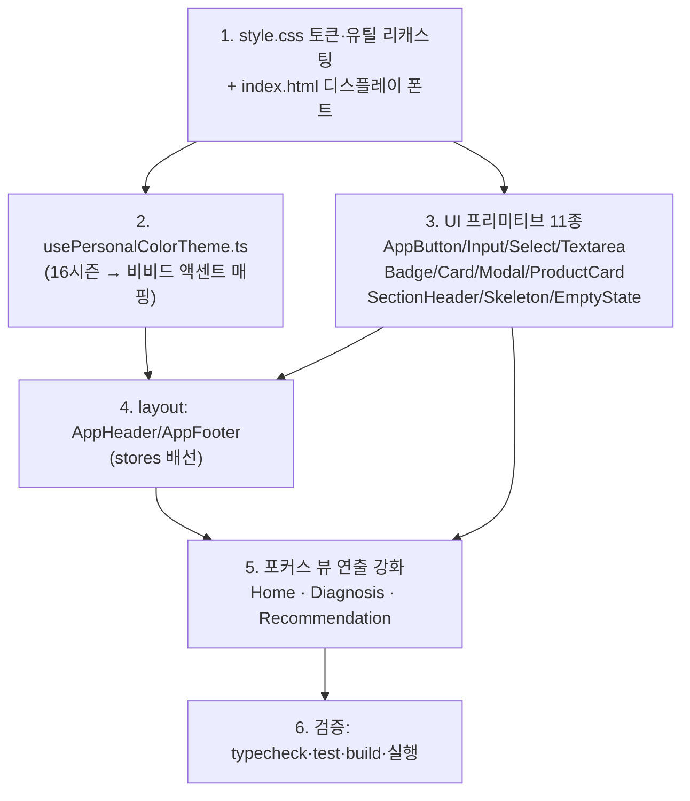

# 학꾸 프론트엔드: 디자인 시스템 복원 + 비비드/플레이풀 꾸미기 리브랜딩

## Context (왜 하는가)

사용자는 "UI/UX가 너무 평범하다, 확 띄는 커머스 감성을 원한다"고 했다. 코드를 열어보니
**근본 원인은 평범함이 아니라 화면이 아예 안 그려지는 상태**였다. `App.vue`와 모든
`views/*.vue`가 다음을 import하지만 실제 파일이 **전부 존재하지 않는다**:

- `components/ui/*` — `AppButton`, `AppInput`, `AppSelect`, `AppTextarea`, `AppBadge`, `AppCard`, `AppModal`, `ProductCard`, `SectionHeader`, `SkeletonBlock`, `EmptyState`
- `components/layout/*` — `AppHeader`, `AppFooter`
- `composables/usePersonalColorTheme.ts`

즉 디자인 시스템의 "잎사귀"가 통째로 비어 있어 `vite build`/`dev`가 깨진다. 반대로
`style.css` 토큰과 뷰 마크업은 이미 정교하게 짜여 있다.

**목표:** (1) 누락 컴포넌트를 모두 구현해 앱을 살리고, (2) 기존의 "에디토리얼 모노크롬"
토큰 체계를 **비비드/플레이풀 꾸미기 커머스**로 리캐스팅하며, (3) **홈(히어로/추천)과
퍼스널컬러 진단/추천** 화면에 추가 연출을 집중한다. 기존 뷰의 props/slot/이벤트 계약과
통과 중인 테스트(`LoginView.test.ts`, `ProductListView.test.ts`)는 절대 깨지 않는다.

## 빌드 의존 순서

## 1단계 — 디자인 토큰 & 유틸리티 리캐스팅 (`src/style.css`)

기존 토큰 **이름은 모두 유지**(뷰가 `bg-ink`, `bg-accent`, `bg-surface-soft`, `border-line`,
`u-container`, `u-eyebrow`, `u-serif`, `u-rise`, `text-display/headline/title/eyebrow` 등을
참조하므로 이름이 바뀌면 전 화면이 깨진다). **값과 추가 유틸만** 바꿔 평범함을 제거한다.

`@theme` 블록 수정:
- **캔버스를 살짝 톤 입히기**: `--color-canvas: #fffdfb` (웜 오프화이트), `--color-surface-soft`,
  `--color-surface-sunken`을 미세 채도 톤으로.
- **기본 액센트를 비비드 브랜드 컬러로**: `--color-accent: #ff4d8d`(비비드 핑크) 계열로 변경
  (기존 near-black `#18181b` 대체). `--color-accent-ink: #ffffff`, `--color-accent-soft`는
  같은 hue의 8% 틴트, `--color-accent-line`은 20% 틴트.
- **그라데이션 2번째 스톱 토큰 추가**: `--color-accent-2: #7c5cff`(바이올렛). 진단 전 기본
  그라데이션(핑크→바이올렛). composable이 시즌별로 두 스톱을 함께 덮어쓴다.
- **반경 키우기(플레이풀)**: `--radius-lg: 14px`, `--radius-xl: 20px`, `--radius-2xl: 28px`.
- **액센트 틴트 그림자 추가**: `--shadow-pop: 0 10px 30px -8px color-mix(in oklab, var(--color-accent) 45%, transparent)`.

`.u-serif` 재정의 — **디스플레이 폰트로 리포인트**(전 화면 헤딩이 클래스명 그대로 새 룩 상속):
- `index.html`에 Google Fonts `Jua`(둥글둥글 친근한 한글 디스플레이) 추가:
  `https://fonts.googleapis.com/css2?family=Jua&display=swap` (기존 Noto Serif 링크 옆에).
- `--font-display: "Jua", "Pretendard Variable", sans-serif;` 토큰 추가, `.u-serif { font-family: var(--font-display); }`.

추가 유틸리티(신규, 이름 충돌 없음):
- `.u-gradient-accent` — `background: linear-gradient(135deg, var(--color-accent), var(--color-accent-2));`
- `.u-gradient-text` — 위 그라데이션 + `background-clip:text; color:transparent;` (히어로 키워드 강조용).
- `.u-pop` — `transition: transform/box-shadow var(--ease-out-expo); &:hover { transform: translateY(-4px); box-shadow: var(--shadow-pop); }` (카드/버튼 호버 리프트).
- `.u-marquee` + `@keyframes u-marquee` — 무한 가로 스크롤 띠(홈 상단 "꾸미기 키워드" 마퀴용, `prefers-reduced-motion`에서 정지).
- `.u-blob` — 둥근 비대칭 `border-radius`(히어로 배경 블롭 장식).
- `@keyframes u-float` / `.u-float` — 은은한 상하 부유(장식 요소).

## 2단계 — `src/composables/usePersonalColorTheme.ts` (신규)

`App.vue`가 `import { applyPersonalColorTheme } from '@/composables/usePersonalColorTheme'`로
사용. 시그니처: `export function applyPersonalColorTheme(color: string | null): void`.

- `PERSONAL_COLOR_ACCENTS: Record<string, { accent: string; accent2: string; ink: string }>` —
  `types/index.ts`의 16개 코드(`LIGHT_SPRING` … `BRIGHT_WINTER`)별 비비드 hex 2스톱 + 대비 ink.
  봄=따뜻한 코랄/피치, 여름=쿨 라벤더/로즈, 가을=머스타드/테라코타, 겨울=마젠타/일렉트릭블루 계열.
- `color`가 매핑에 있으면 `document.documentElement.style.setProperty`로
  `--color-accent`, `--color-accent-2`, `--color-accent-ink`, 그리고 파생값
  `--color-accent-soft`(`color-mix … 10%`), `--color-accent-line`(`… 22%`)를 세팅.
- `color`가 `null`/미매핑이면 위 프로퍼티들을 `removeProperty`하여 `@theme` 기본(비비드 핑크)으로 복귀.
- `color-mix`로 soft/line 파생을 런타임 계산하면 시즌별 하드코딩이 줄어든다.

## 3단계 — UI 프리미티브 11종 (`src/components/ui/*.vue`)

각 컴포넌트의 **정확한 계약은 뷰 사용처에서 역산**한 것이며 반드시 지킬 것. 모두
`<script setup lang="ts">`, Vue 3.5 (`defineModel` 사용 가능).

| 파일 | props | v-model | slots | 비고 |
|---|---|---|---|---|
| `AppButton.vue` | `to?:string`, `variant?:'primary'\|'secondary'\|'ghost'`(기본 primary), `size?:'sm'\|'md'\|'lg'`(기본 md), `block?:boolean`, `disabled?:boolean`, `loading?:boolean`, `type?:string`(기본 button) | — | default=라벨 | `to` 있으면 `<router-link>`, 없으면 실제 `<button>`(테스트가 `getByRole('button')`+`toBeDisabled` 확인). primary=`u-gradient-accent` 텍스트 `accent-ink`, secondary=surface+border, ghost=투명. `loading`/`disabled`→`disabled` 속성+스피너. `u-pop` 호버. rounded-full. |
| `AppInput.vue` | `label?`, `type?`(기본 text), `placeholder?`, `required?`, `autocomplete?` | `modelValue`(`defineModel`) | — | **label↔input 연결 필수**(`getByLabelText(/이메일/i)`). 고유 id(`useId()`) → `<label :for>`+`<input :id>`. 나머지 attr는 `v-bind="$attrs"` fallthrough. 포커스 시 accent 링. |
| `AppTextarea.vue` | `label?`, `placeholder?`, `rows?:number` | `modelValue` | — | AppInput과 동일 패턴의 `<textarea>`. |
| `AppSelect.vue` | `label?` | `modelValue` | default=`<option>`들 | 네이티브 `<select>`, 슬롯으로 옵션 주입(SellerProductsView 사용). label 연결. |
| `AppBadge.vue` | `variant?:'default'\|'accent'`(기본 default) | — | default | 작은 pill. accent=`accent-soft` 배경 + `accent` 텍스트. |
| `AppCard.vue` | `padded?:boolean` | — | default | surface 배경, `border-line`, `rounded-2xl`, `shadow-sm`. `padded`면 내부 패딩. `$attrs`로 class 병합(`class="mb-6"` 등 사용됨). |
| `AppModal.vue` | `title?`, `maxWidth?:'sm'\|'md'\|'lg'`(attr명 `max-width`) | `open`(`update:open`) | default=본문 | `<Teleport to="body">`, 백드롭+Esc 클릭 시 `update:open(false)`, 닫기 버튼, fade/scale 트랜지션, body 스크롤 락. |
| `ProductCard.vue` | `product:Product` | — | `#meta` | `<router-link :to="\`/products/${product.id}\`">`. 이미지(`imageUrl` 없으면 그라데이션 플레이스홀더+카테고리 글리프), 이름(텍스트), **가격 `{{ product.price.toLocaleString() }}원`**(테스트가 `/5,900/` 확인). `#meta` 슬롯은 가격 아래. `u-pop` 호버 리프트 + 이미지 줌. |
| `SectionHeader.vue` | `eyebrow?`, `title`, `description?` | — | `#action` | `u-eyebrow` 라벨 + `u-serif text-title` 헤딩(`<h2>`) + 설명. `#action`은 우측 정렬. |
| `SkeletonBlock.vue` | `height?:string`, `width?:string` | — | — | 단일 `
`, `:style="{height,width}"` + shimmer 애니메이션 + 기본 `rounded`. `$attrs` class 병합(`!rounded-full`, `aspect-square` 오버라이드 사용됨). |
| `EmptyState.vue` | `icon?`, `title`, `description?` | — | default(액션) | 중앙 정렬, 큰 글리프, 타이틀(`u-serif`), 설명, 그 아래 default 슬롯(Recommendation에서 `<AppButton>` 감쌈). |

스타일 공통: 둥근 반경·비비드 액센트·`u-pop` 호버·부드러운 트랜지션으로 "플레이풀 커머스" 톤 통일.

## 4단계 — 레이아웃 (`src/components/layout/*.vue`)

**`AppHeader.vue`** — `useAuthStore`(`isAuthenticated`, `user`, `logout`), `useNotificationStore`(`hasUnread`) 사용.
- sticky top, 반투명 blur 바. 좌측: `/public/logo.png` + "학꾸" 워드마크(`u-serif`).
- 네비: 상품(`/products`), 커뮤니티(`/community`). 활성 라우트 언더라인/액센트.
- 우측(인증): 진단(`/diagnosis`), 알림(`/notifications`, `hasUnread`면 액센트 점 배지),
  장바구니(`/cart`), 마이(`/my`), `role==='SELLER'`면 판매(`/seller/products`), 로그아웃.
- 우측(게스트): 로그인(`/login`), 회원가입(`/signup`, `AppButton` primary).
- 모바일: 햄버거 토글 드로어. 아이콘은 뷰들처럼 인라인 SVG 사용(`public/icons.svg` 스프라이트는
  Vite 기본 소셜 아이콘이라 부적합).

**`AppFooter.vue`** — 브랜드 한 줄 소개, 간단 링크(상품/커뮤니티/진단), 저작권. `border-line` 상단 구분선.

## 5단계 — 포커스 뷰 연출 강화 (테스트 없는 뷰만 템플릿 수정)

`HomeView.vue`, `DiagnosisView.vue`, `RecommendationView.vue`는 테스트가 없으므로 **스크립트
로직(상태·API 호출)은 그대로 두고 템플릿/클래스에 연출을 가산**한다. (`ProductListView`,
`LoginView`는 테스트 보호 대상 → 컴포넌트 룩으로만 개선, 구조 변경 금지.)

- **HomeView 히어로**: 비로그인 웰컴에 `u-gradient-text`로 "색"·"나" 키워드 강조, 배경 `u-blob`+`u-float`
  장식, 기존 그레이 톤 램프를 비비드 그라데이션 스와치로 교체. 상단에 `u-marquee` 키워드 띠
  ("핀뱃지 · 키링 · 스티커 · 퍼스널컬러 …"). `COMPLETED` 패널은 이미 `bg-accent-soft`라 시즌 컬러로
  자동으로 물든다 — 여기에 `u-gradient-accent` 헤일로/✦ 플로팅 추가.
- **DiagnosisView**: `COMPLETED` 결과 카드 상단을 `u-gradient-accent` 풀블리드 헤더로, 결과 라벨에
  `u-gradient-text`. 업로드 드롭존 호버/드래그 상태를 더 생동감 있게(점선→그라데이션 보더).
- **RecommendationView**: `SectionHeader` 아래 퍼스널컬러 컨텍스트 배지, 추천점수 메타를 액센트 게이지
  바 형태로 시각화(현재 숫자만 표시 → `item.score` 기반 미니 바, `--color-accent` 채움).

## 생성/수정 파일 요약

**신규(14):** `composables/usePersonalColorTheme.ts`, `components/ui/{AppButton,AppInput,AppTextarea,AppSelect,AppBadge,AppCard,AppModal,ProductCard,SectionHeader,SkeletonBlock,EmptyState}.vue`, `components/layout/{AppHeader,AppFooter}.vue`.

**수정(4):** `src/style.css`(토큰·유틸 리캐스팅), `index.html`(Jua 폰트), `src/views/{HomeView,DiagnosisView,RecommendationView}.vue`(연출 가산).

**건드리지 않음:** stores, api, router, types, `ProductListView.vue`, `LoginView.vue` 및 그 외 뷰의 로직.
(`components/HelloWorld.vue`는 미사용 — 그대로 두거나 삭제 가능.)

## 검증

1. `cd frontend && npm install` (이미 lock 존재) 후:
2. `npm run typecheck` — vue-tsc 0 에러(특히 컴포넌트 prop 타입·`defineModel` 시그니처).
3. `npm test` — 기존 `LoginView.test.ts`(라벨/버튼/disabled/alert), `ProductListView.test.ts`
   (heading "상품", role=status 스피너, 상품명, 가격 `5,900`), 스토어 테스트 전부 통과.
   → AppInput 라벨 연결, AppButton 네이티브 button+disabled, ProductCard 가격 `toLocaleString`이
   이 테스트들의 사활을 가르므로 우선 확인.
4. `npm run build` — vite 빌드 성공(누락 import 0).
5. `npm run dev` 후 실제 화면 점검: 헤더/푸터 렌더, 홈 히어로 마퀴·그라데이션, 게스트/인증 분기,
   진단 업로드 폼, 모달 열림/Esc 닫힘, 퍼스널컬러 진단 완료 시 전역 액센트가 시즌 컬러로 물드는지
   (`applyPersonalColorTheme` 동작), 모바일 폭에서 헤더 드로어.
6. `prefers-reduced-motion` 환경에서 마퀴/플로트가 정지하는지 확인.
