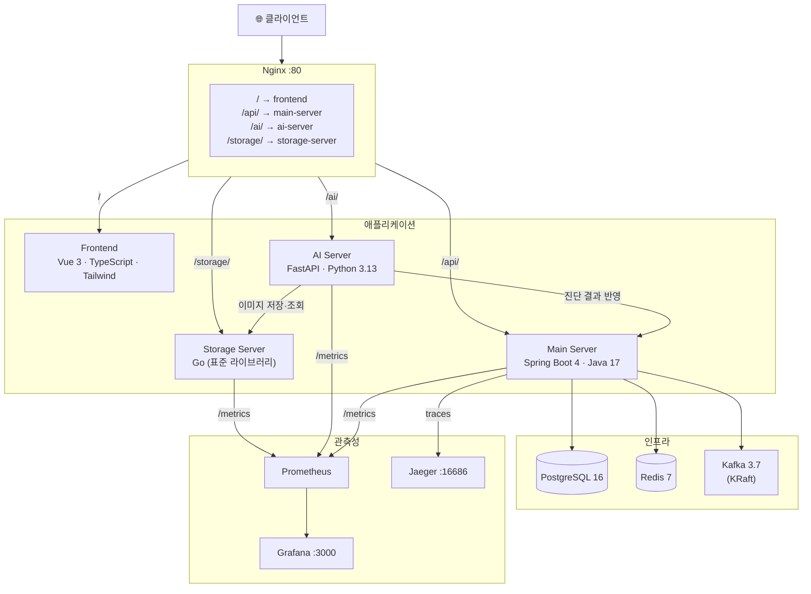
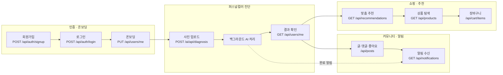
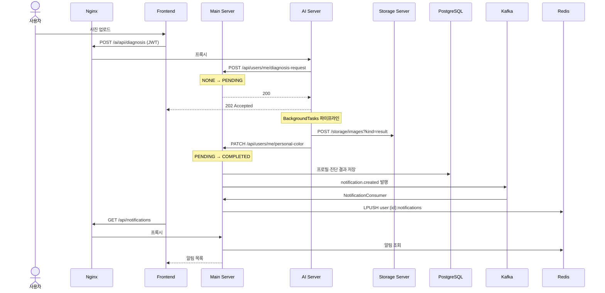
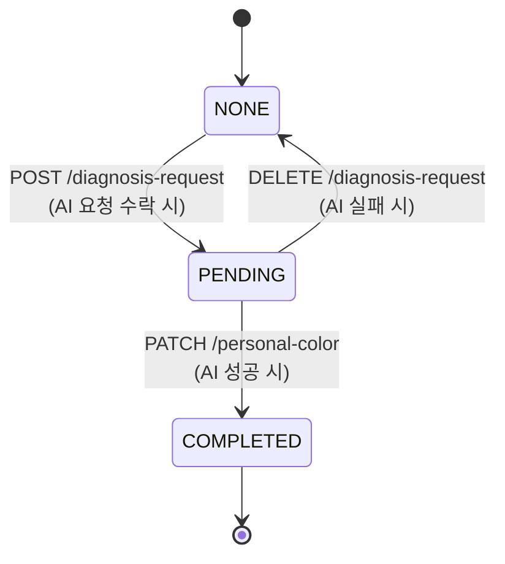
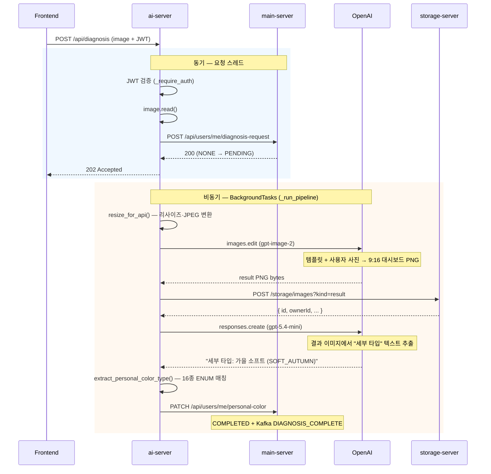

# 학꾸 (Hakku)

AI 퍼스널컬러 기반 꾸미기 아이템 추천 커머스·커뮤니티 플랫폼.

사용자가 얼굴 사진을 업로드하면 AI가 16종 퍼스널컬러를 진단하고, 진단 결과와 활동 이력을 바탕으로 스티커·뱃지·꾸미기 아이템을 개인화 추천한다.

---

## 아키텍처

Nginx 리버스 프록시 뒤에 4개 서비스가 독립 실행되는 폴리글랏 마이크로서비스 구조.



| 서비스 | 스택 | 책임 |
|---|---|---|
| `frontend` | Vue 3 + Vite + TypeScript + Tailwind + Pinia | 사용자 화면 |
| `main-server` | Spring Boot 4.0.6 (Java 17) | 회원·인증·커뮤니티·상품·추천·알림 |
| `ai-server` | FastAPI (Python 3.13) | 퍼스널컬러 진단, OpenAI 연동 |
| `storage-server` | Go 1.24 (표준 라이브러리) | 이미지 저장·서빙 |

**지원 인프라** — PostgreSQL · Redis · Kafka (KRaft) · Prometheus · Grafana · Jaeger

---

## 핵심 서비스 흐름도

### 사용자 여정



| 단계 | 화면 | 핵심 API | 설명 |
|---|---|---|---|
| 1. 가입·로그인 | `/signup`, `/login` | `POST /api/auth/*` | JWT 발급, NORMAL은 온보딩 미완료 시 주요 페이지 접근 차단 |
| 2. 온보딩 | `/onboarding` | `PUT /api/users/me` | 선호 컬러·스타일 설정, `onboardingCompleted=true` |
| 3. 진단 요청 | `/diagnosis` | `POST /ai/api/diagnosis` | 즉시 202 반환, 백그라운드 처리 |
| 4. 결과 확인 | `/my` | `GET /api/users/me` | `personalColor`, `diagnosisImageUrl` 표시 |
| 5. 추천 | `/recommendations` | `GET /api/recommendations` | 퍼스널컬러·선호·행동 로그 기반 점수 산출 |
| 6. 상품 | `/products` | `GET /api/products` | 외부 `purchaseUrl`로 구매 (결제 미구현) |
| 7. 커뮤니티 | `/community` | `/api/posts`, `/api/comments` | 댓글·좋아요 시 대상자에게 알림 발행 |
| 8. 알림 | `/notifications` | `GET /api/notifications` | Kafka→Redis 저장분을 폴링으로 조회 |

### 서비스 간 상호작용

프론트엔드는 비즈니스 API는 **Main Server**만, 진단은 **AI Server**만, 이미지는 **Storage Server**만 직접 호출한다. AI Server는 처리 중 Main·Storage를 서버 간 HTTP로 호출한다.



### 진단 상태 머신

사용자 프로필의 `diagnosisStatus`는 아래 상태 전이를 따른다.



### 알림 파이프라인

알림은 실시간 push 없이 **Kafka → Redis → 폴링** 구조로 동작한다.

| 트리거 | `NotificationType` | 수신자 |
|---|---|---|
| 진단 완료 | `DIAGNOSIS_COMPLETE` | 본인 |
| 댓글 작성 | `COMMENT` | 글 작성자 |
| 좋아요 | `LIKE` | 글 작성자 |

```
Producer (Main Server) → Kafka topic: notification.created
  → Consumer (NotificationConsumer) → Redis List: user:{userId}:notifications (최대 50건)
    → Frontend 폴링: GET /api/notifications
```

### 추천 점수 산출

`RecommendationScoreCalculator`가 아래 요소를 합산해 상품별 점수를 계산하고, 점수 구성 요소를 응답에 포함한다.

| 요소 | 설명 |
|---|---|
| 퍼스널컬러 일치도 | 사용자 16종 세부 타입 → 계절 단위 환원 후 상품 태그와 비교 |
| 선호 스타일·컬러 | 온보딩 시 설정한 `preferredStyles`, `preferredColors` |
| 행동 로그 | 클릭·찜·장바구니 등 최근 활동 |
| 상품 인기도 | 리뷰 평점·인기 지표 |

---

## AI 프로세스 흐름도

### 전체 파이프라인

사용자가 사진을 올리면 AI Server가 **슬롯 잠금 → 202 즉시 반환 → 백그라운드 처리** 순으로 동작한다. 페이지를 이탈해도 요청은 계속 처리되고, 완료 시 Kafka 알림이 발행된다.



### 단계별 처리 상세

| # | 단계 | 모듈 | 함수 | sync/async | 설명 |
|---|---|---|---|---|---|
| 1 | 슬롯 잠금 | `main_client` | `request_diagnosis_start()` | sync | 중복 요청 시 409 |
| 2 | 전처리 | `preprocess` | `resize_for_api()` | sync | 긴 변 1024px, RGBA→흰 배경, JPEG q=90 |
| 3 | 이미지 생성 | `generator` | `generate_analysis_image()` | async | gpt-image-2 `images.edit`, 1024×1824 |
| 4 | 결과 저장 | `storage` | `upload_result_image()` | async | `kind=result`, JWT→ownerId |
| 5 | 텍스트 추출 | `vision` | `extract_color_from_image()` | async | gpt-5.4-mini Responses API |
| 6 | ENUM 파싱 | `ocr` | `extract_personal_color_type()` | sync | 16종 퍼스널컬러 매칭 |
| 7 | 결과 반영 | `main_client` | `update_user_diagnosis()` | async | personalColor + resultImageUrl |

### OpenAI 모델 사용

| 모델 | API | 입력 | 출력 |
|---|---|---|---|
| `gpt-image-2` | `images.edit()` | 템플릿(`result1.png`) + 전처리 JPEG | 9:16 퍼스널컬러 대시보드 PNG |
| `gpt-5.4-mini` | `responses.create()` | 생성 PNG (base64) | `세부 타입: {한글명} ({ENUM})` 한 줄 |

### 16종 퍼스널컬러 추출 (OCR)

Vision API가 반환한 텍스트에서 `ocr.extract_personal_color_type()`이 아래 우선순위로 ENUM을 결정한다.

1. **직접 ENUM 매칭** — 괄호 안 코드 검색 (예: `SOFT_AUTUMN`)
2. **한글 라벨 매칭** — 16종 한글명 substring (가장 긴 키워드 우선)
3. **계절 → 톤 fallback** — 계절 키워드 확정 후 톤 키워드로 세부 타입 추론

| 계절 | 세부 타입 |
|---|---|
| 봄 | `LIGHT_SPRING`, `TRUE_SPRING`, `BRIGHT_SPRING`, `CLEAR_SPRING` |
| 여름 | `LIGHT_SUMMER`, `TRUE_SUMMER`, `SOFT_SUMMER`, `COOL_SUMMER` |
| 가을 | `SOFT_AUTUMN`, `TRUE_AUTUMN`, `DEEP_AUTUMN`, `MUTED_AUTUMN` |
| 겨울 | `BRIGHT_WINTER`, `TRUE_WINTER`, `DEEP_WINTER`, `CLEAR_WINTER` |

### 에러 처리

| 실패 지점 | 동작 |
|---|---|
| 슬롯 잠금 409 | 즉시 409 반환 (이미 진행 중·완료) |
| 파이프라인 예외 | `DELETE /api/users/me/diagnosis-request` → NONE 복구 |
| OCR 매칭 실패 (`None`) | 동일하게 NONE 복구, 사용자 재시도 가능 |

백그라운드 실패 시 클라이언트는 이미 202를 받은 상태이므로, 사용자는 프로필 폴링 또는 알림으로 결과를 확인한다.

---

## 주요 특징

### 이미지 트래픽 분리

Main Server는 이미지 바이트를 다루지 않는다. Nginx 레벨에서 라우팅이 분리되어 이미지 업로드·다운로드가 비즈니스 서버를 통과하지 않는다.

```
[진단] Frontend → Nginx → AI Server → (내부) Storage Server
[상품] Frontend → Nginx → Storage Server
```

### 퍼스널컬러 결과 이미지 접근 제어

AI가 생성한 퍼스널컬러 진단 결과 이미지(`kind=result`)는 JWT 인증을 통과한 본인만 다운로드할 수 있다.

- 업로드 시 사용자의 JWT를 Storage Server에 전달 → `ownerId`로 메타데이터에 저장
- 다운로드 시 Bearer 토큰 검증 + `sub` 클레임과 `ownerId` 일치 여부 확인 → 불일치 시 403
- `JWT_SECRET` 미설정 환경(로컬 개발)에서는 인증 없이 동작하고 경고 로그를 출력한다
- `raw` 종류 이미지(AI 처리용 원본)는 영향 없음

### 콘텐츠 기반 추천 엔진

퍼스널컬러 일치도, 선호 스타일 일치도, 최근 행동 로그(클릭·찜·장바구니), 상품 인기도·리뷰 점수를 합산해 점수를 산출한다. 점수 구성 요소를 분해해서 응답에 포함하므로 추천 이유를 설명할 수 있다.

### Storage Server Go vs Spring 비교

Go 표준 라이브러리로 구현한 `storage-server`와 동일 API·JWT 정책을 제공하는 Spring Boot 구현체(`storage-server-spring`)를 병렬로 제공한다. 두 구현체 모두 `kind=result` 이미지에 대해 JWT Bearer 검증 및 `ownerId` 기반 다운로드 접근 제어를 적용한다.

#### 공정 벤치마크 환경

이전 측정은 Go가 메인 compose 안에서 다른 서비스와 리소스를 공유하고 Spring은 거의 단독 환경이어서 결과가 왜곡되었다. 아래 조건으로 **격리된 공정 환경**을 구성해 재측정했다.

| 항목 | 값 |
|---|---|
| Compose | `compose/storage-bench.yml` |
| JWT | 동일 `JWT_SECRET` (양쪽 활성화) |
| 리소스 한도 | CPU 2코어, 메모리 512MB (각각) |
| 포트 | Go `8081`, Spring `8082` |
| 워크로드 | k6 — 실제 이미지(72KB~865KB) 업로드 → 다운로드 → 삭제 (`kind=raw`) |
| 스크립트 | `./scripts/benchmark-storage-fair.sh` |

```bash
# 공정 벤치 (권장)
VUS=20  DURATION=60s ./scripts/benchmark-storage-fair.sh
VUS=100 DURATION=60s ./scripts/benchmark-storage-fair.sh

# 전체 아키텍처 부하 (main-server 경유, 비교 참고용)
./scripts/benchmark-storage.sh
```

#### 벤치마크 결과 (2026-06-10, 오류율 0%)

| 부하 | 지표 | Spring | Go | Go 개선 |
|---|---|---:|---:|---:|
| **20 VU** | 처리량 (req/s) | 939 | 3,610 | **+285%** |
| | 업로드 p95 | 75ms | 15ms | **+81%** |
| | 다운로드 p95 | 80ms | 16ms | **+80%** |
| **100 VU** | 처리량 (req/s) | 926 | 2,340 | **+153%** |
| | 업로드 p95 | 479ms | 132ms | **+73%** |
| | 다운로드 p95 | 208ms | 121ms | **+42%** |

공정 환경에서는 **Go가 처리량·지연 모두 우세**하다. 차이의 주요 원인은 JWT가 아니라 런타임·프레임워크 비용이다. Go는 `net/http` + `io.Copy` 스트리밍으로 가볍게 처리하고, Spring Boot는 JVM·Tomcat·Spring MVC·Jackson·Actuator 메트릭 파이프라인을 매 요청마다 거친다. 512MB 한도에서 Spring 유휴 메모리(~173MB)가 Go(~33MB)보다 크고, 고부하 시 GC·디스크 I/O 병목으로 격차가 100 VU에서 153%까지 줄어든다.

> `kind=raw` 픽스처만 사용하므로 JWT 검증 경로는 벤치 부하에 포함되지 않는다. JWT 동작은 단위 테스트(`JwtValidatorTest`)로 검증한다.

### 관측성

세 백엔드 모두 `/metrics` 엔드포인트를 노출한다. Prometheus가 메트릭을 수집하고 Grafana 대시보드로 시각화한다.

| 대시보드 | URL | 내용 |
|---|---|---|
| Service Overview | http://localhost:3000/d/hakku-overview | 전체 서비스 HTTP·JVM |
| **Storage 벤치마크** | http://localhost:3000/d/hakku-storage-bench | Go vs Spring 처리량·P95·CPU·메모리 |

```bash
docker compose -f compose/obs.yml up -d   # Prometheus + Grafana + Jaeger
```

Jaeger(`http://localhost:16686`)는 기동 가능하나, Storage 서버에는 OpenTelemetry tracing이 아직 연동되지 않아 트레이스 데이터는 없다. Storage 성능 비교는 Grafana/Prometheus를 사용한다.

---

## 실행

### 데이터셋 준비

> [Google Drive — hakku_dataset.zip 다운로드](https://drive.google.com/file/d/1OtBROPRBg4sGTOoLM843mMl1klmXItge/view?usp=sharing)

다운로드 후 `data/` 디렉터리에 압축 해제한다.

### 환경변수 설정

```bash
cp .env.example .env
# POSTGRES_PASSWORD, JWT_SECRET, OPENAI_API_KEY 값을 채운다
```

### 기동

```bash
# 전체 스택
docker compose up -d --build

# 관측성 스택 (선택)
docker compose -f compose/obs.yml up -d
```

| 엔드포인트 | 주소 |
|---|---|
| 프론트엔드 | http://localhost |
| Main API | http://localhost/api |
| AI API | http://localhost/ai |
| Storage | http://localhost/storage |
| Grafana | http://localhost:3000 |
| Jaeger | http://localhost:16686 |
