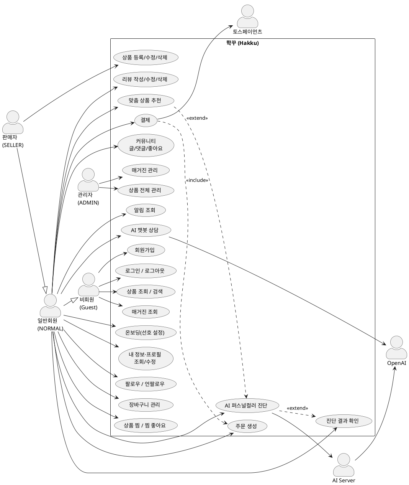

# Use-case Diagram (유스케이스 다이어그램 및 명세서)

> 프로젝트: 학꾸(Hakku) · 작성일: 2026-06-25 · 버전 1.0

---

## 1. 개요

### 1.1 목적

본 문서는 학꾸(Hakku) — AI 퍼스널컬러 기반 꾸미기 아이템 추천 커머스·커뮤니티 플랫폼 — 의 기능 범위를 액터(Actor) 관점에서 정의한다. 시스템이 제공하는 사용자 가치를 유스케이스(Use Case) 단위로 식별하고, 각 유스케이스의 행위 흐름(기본·대안·예외)을 명세하여 후속 산출물(요구사항 정의서, 화면설계서, API 명세, 테스트 설계)의 추적성 기준점을 마련하는 것을 목적으로 한다.

본 문서에서 정의하는 식별자는 다음 ID 스킴을 따르며, 다른 설계 문서와 상호참조된다.

| 식별자 | 형식 | 의미 |
|---|---|---|
| 유스케이스 | UC-{n} | UC-01 ~ UC-21 |
| 기능 요구사항 | FR-{영역}-{n} | 영역: 01회원/인증, 02진단, 03상품/커머스, 04주문/결제, 05추천, 06커뮤니티, 07알림, 08매거진, 09관리자, 10챗봇 |
| 화면 | SCR-01 ~ SCR-22 | 화면설계서의 View 식별자 |

### 1.2 액터 정의

학꾸의 액터는 시스템을 직접 사용하는 **주액터(Primary Actor)** 와 시스템이 가치를 실현하기 위해 협력하는 **부액터/시스템 액터(Secondary/System Actor)** 로 구분된다.

#### 1.2.1 주액터 (사용자 유형)

| 액터 | 코드 | 권한 범위 | 비고 |
|---|---|---|---|
| 비회원 | (Guest) | 홈·상품·커뮤니티·매거진 **조회** | 인증 불요 공개 영역 |
| 일반회원 | NORMAL | 비회원 권한 + 장바구니·주문·결제·리뷰·찜·팔로우·커뮤니티 작성·AI 진단·추천·알림 | 온보딩(선호 설정) 필수 |
| 판매자 | SELLER | 일반회원 권한 + 본인 상품 등록/수정/삭제 | 일반회원의 모든 행위 가능 |
| 관리자 | ADMIN | 매거진 CRUD · 상품 전체 관리 | 운영 권한 |

#### 1.2.2 부액터 / 시스템 액터

| 액터 | 유형 | 역할 |
|---|---|---|
| AI Server | 내부 시스템 | 퍼스널컬러 진단 파이프라인(이미지 처리·진단 오케스트레이션) 수행 |
| OpenAI | 외부 시스템 | gpt-image-2(이미지 생성), gpt-5.4-mini(세부 타입 추출·챗봇 응답) 제공 |
| 토스페이먼츠 | 외부 시스템(PG) | 결제 위젯·승인(confirm)·웹훅 제공 |
| Storage Server | 내부 시스템 | 진단 원본/결과 이미지 저장·서빙(JWT ownerId 접근제어) |
| Kafka | 내부 시스템 | 진단 완료·결제 승인·알림 생성 이벤트 비동기 전파 |
| 학꾸AI 챗봇 | 내부 시스템 | SSE 스트리밍 고객센터 상담(function-calling) |

> **다이어그램 표기 범위 안내**: 본 문서 §2의 유스케이스 다이어그램은 가독성을 위해 **AI Server·토스페이먼츠·OpenAI** 등 사용자 행위와 직접 맞닿는 핵심 시스템 상호작용만 도시한다. Storage Server·Kafka·학꾸AI 챗봇은 위 표가 정의하는 완전한 액터 인벤토리에 포함되며, 각 유스케이스 명세(§3)의 흐름 단계에서 협력 주체로 기술된다. 다이어그램에 모든 시스템 액터가 나타나지 않는 것은 오류가 아니라 도시 범위 선택의 결과이다.

### 1.3 액터 일반화(Generalization) 관계

학꾸의 주액터는 권한 누적 구조를 가지며, 이는 다이어그램에서 일반화(▷) 화살표로 표현된다.

- **판매자(SELLER) ▷ 일반회원(NORMAL)**: 판매자는 일반회원이 수행하는 모든 유스케이스(장바구니·주문·결제·진단·추천·커뮤니티 등)를 그대로 수행할 수 있으며, 추가로 본인 상품 등록/수정/삭제(UC-09)를 수행한다.
- **일반회원(NORMAL) ▷ 비회원(Guest)**: 일반회원은 비회원에게 허용된 공개 조회 유스케이스(회원가입·로그인·상품 조회·매거진 조회)를 모두 포함한다. 즉 조회 행위는 비회원 공통 기반으로 상위 액터에 상속된다.
- 정리하면 일반화 체인은 **판매자 ▷ 일반회원 ▷ 비회원** 이다. 하위 액터가 가진 유스케이스 접근권은 상위 액터에 자동 상속되므로, 상위 액터에는 차이 나는(추가) 유스케이스만 연결한다.
- **관리자(ADMIN)** 는 위 일반화 체인에 포함되지 않는 **독립 운영 액터**로, 매거진 관리(UC-19)·상품 전체 관리(UC-20)에만 연결된다.

---

## 2. 유스케이스 다이어그램

아래 다이어그램은 학꾸의 전체 유스케이스와 액터, 그리고 액터 간 일반화 및 유스케이스 간 include/extend 관계를 정식 UML 표기로 나타낸다.

**그림 2-1. 학꾸 유스케이스 다이어그램**

---

## 3. 유스케이스 명세

### 3.1 핵심 유스케이스 완전 명세 (8종)

학꾸의 핵심 가치를 구성하는 8개 유스케이스(회원가입, 로그인/로그아웃, AI 퍼스널컬러 진단, 맞춤 상품 추천, 주문 생성, 결제, 커뮤니티 글/댓글/좋아요, AI 챗봇 상담)에 대해 사전·기본·대안·예외·사후조건과 추적성을 포함하는 완전 명세를 제공한다.

#### UC-01 회원가입

| 항목 | 내용 |
|---|---|
| 유스케이스 ID | UC-01 |
| 유스케이스명 | 회원가입 |
| 액터 | 비회원(Guest) |
| 우선순위 | 높음 (Must) |
| 사전조건 | 1) 사용자가 비로그인 상태이다. 2) 가입하려는 이메일이 미등록 상태이다. |
| 기본 흐름 | 1. 비회원이 회원가입 화면(SCR-03)에 진입한다. 2. 이메일, 비밀번호, 닉네임, 역할(NORMAL/SELLER)을 입력한다. 3. 시스템이 입력값을 검증한다(이메일 형식·중복, 비밀번호 정책, 닉네임 필수). 4. 시스템이 비밀번호를 해시(password_hash)하여 `users`에 신규 레코드를 생성한다(role, diagnosis_status=NONE, onboarding_completed=false). 5. 시스템이 가입 성공을 응답하고 로그인 화면(SCR-02)으로 안내한다. |
| 대안 흐름 | 3a. 역할로 SELLER를 선택한 경우에도 동일 절차로 가입하되 role=SELLER로 저장한다. 5a. 가입 직후 자동 로그인 정책이 적용되는 경우 로그인 처리 후 온보딩(SCR-04)으로 분기한다. |
| 예외 흐름 | 3-E1. 이메일이 이미 존재하면(UK 위반) 중복 오류 메시지를 표시하고 단계 2로 복귀한다. 3-E2. 비밀번호가 정책에 미달하면 검증 오류를 표시한다. 3-E3. 닉네임 등 필수값 누락 시 해당 필드 오류를 표시한다. |
| 사후조건 | `users`에 신규 회원 레코드가 생성된다(role 확정, diagnosis_status=NONE, onboarding_completed=false). |
| 관련 FR | FR-01-01(회원가입), FR-01-06(입력값 검증·이메일 중복 방지) |
| 관련 SCR | SCR-03(SignupView), SCR-02(LoginView) |

#### UC-02 로그인 / 로그아웃

| 항목 | 내용 |
|---|---|
| 유스케이스 ID | UC-02 |
| 유스케이스명 | 로그인 / 로그아웃 |
| 액터 | 비회원(로그인), 일반회원·판매자·관리자(로그아웃) |
| 우선순위 | 높음 (Must) |
| 사전조건 | 로그인: 가입된 계정이 존재한다. 로그아웃: 사용자가 로그인 상태이다(유효 JWT 보유). |
| 기본 흐름 | 1. 비회원이 로그인 화면(SCR-02)에서 이메일·비밀번호를 입력한다. 2. 시스템이 자격증명을 검증하고 일치 시 Access/Refresh JWT를 발급한다. 3. 프론트가 토큰을 저장하고 사용자 컨텍스트(role, onboarding 여부)를 적재한다. 4. 온보딩 게이트 검사: NORMAL이면서 onboarding_completed=false이면 온보딩(SCR-04)으로, 그 외에는 직전 redirect 경로 또는 홈(SCR-01)으로 이동한다. 5. (로그아웃) 사용자가 로그아웃을 요청하면 시스템이 해당 토큰을 `jwt:blacklist:{token}`에 등록하고 클라이언트 토큰을 폐기한다. |
| 대안 흐름 | 2a. Access 토큰 만료 시 Refresh 토큰으로 재발급(refresh)하여 세션을 연장한다. |
| 예외 흐름 | 2-E1. 자격증명 불일치 시 인증 실패 메시지를 표시하고 단계 1로 복귀한다. 2-E2. 블랙리스트에 등록된 토큰으로 보호 API 접근 시 401을 반환한다. 4-E1. 미인증 상태로 보호 경로 접근 시 `/login?redirect=...`로 리다이렉트한다. |
| 사후조건 | 로그인: 유효 JWT가 발급되고 인증 세션이 성립한다. 로그아웃: 토큰이 블랙리스트 처리되어 무효화된다. |
| 관련 FR | FR-01-02(로그인/JWT 발급), FR-01-03(로그아웃/토큰 블랙리스트), FR-01-04(토큰 갱신), FR-01-07(라우트 가드·온보딩 게이트) |
| 관련 SCR | SCR-02(LoginView), SCR-04(OnboardingView), SCR-01(HomeView) |

#### UC-06 AI 퍼스널컬러 진단

| 항목 | 내용 |
|---|---|
| 유스케이스 ID | UC-06 |
| 유스케이스명 | AI 퍼스널컬러 진단 |
| 액터 | 일반회원(NORMAL) / 판매자(SELLER) · (시스템) AI Server, OpenAI, Storage Server, Kafka |
| 우선순위 | 높음 (Must) |
| 사전조건 | 1) 사용자가 로그인 상태이다. 2) 진단 상태(diagnosis_status)가 NONE 또는 재진단 가능 상태이다. |
| 기본 흐름 | 1. 사용자가 진단 화면(SCR-11)에서 얼굴 사진을 업로드한다. 2. 프론트가 ai-server `/ai/api/diagnosis`로 이미지를 전송한다. 3. ai-server가 JWT를 검증하고 즉시 202(Accepted)를 반환하며 진단 상태를 PENDING으로 전이시킨다. 4. (백그라운드) ai-server가 이미지를 리사이즈한 뒤 OpenAI gpt-image-2로 진단용 결과 이미지를 생성한다. 5. 생성 이미지를 Storage Server에 result 종류로 저장한다(JWT ownerId 접근제어 대상). 6. OpenAI gpt-5.4-mini로 세부 타입 텍스트를 추출하고 16종 PersonalColorType ENUM으로 파싱한다. 7. ai-server가 main-server에 personal-color를 PATCH하여 진단 결과를 저장하고 diagnosis_status를 COMPLETED로 전이시킨다. 8. main-server가 Kafka로 DIAGNOSIS_COMPLETE 이벤트를 발행하여 알림 파이프라인을 트리거한다. 9. 사용자는 진단 완료 알림을 수신하고 결과를 확인한다(UC-07로 확장). |
| 대안 흐름 | 1a. 사용자가 기존 진단 요청을 취소(diagnosis-request DELETE)하면 진행 중 요청을 중단하고 상태를 NONE으로 되돌린다. 9a. 진단 완료 후 사용자는 추천(UC-13)으로 자연스럽게 연계 이동한다. |
| 예외 흐름 | 3-E1. JWT 검증 실패 시 401을 반환하고 진단을 시작하지 않는다. 4-E1 ~ 7-E1. OpenAI 호출 실패·이미지 저장 실패·ENUM 파싱 실패 등 파이프라인 중 어느 단계라도 실패하면 진단 상태를 NONE으로 복구하고 실패를 통지한다(상태머신 NONE→PENDING→COMPLETED, 실패 시 →NONE). |
| 사후조건 | 성공: `users.personal_color`에 16종 중 하나가 저장되고 diagnosis_status=COMPLETED, 결과 이미지가 Storage에 보관되며 DIAGNOSIS_COMPLETE 알림이 적재된다. 실패: diagnosis_status=NONE으로 원복된다. |
| 관련 FR | FR-02-01(사진 업로드·진단 요청), FR-02-02(비동기 202·상태머신), FR-02-03(OpenAI 진단 파이프라인), FR-02-04(결과 이미지 저장·접근제어), FR-02-05(진단 완료 이벤트/알림) |
| 관련 SCR | SCR-11(DiagnosisView), SCR-19(MyPageView), SCR-18(NotificationView) |

#### UC-13 맞춤 상품 추천

| 항목 | 내용 |
|---|---|
| 유스케이스 ID | UC-13 |
| 유스케이스명 | 맞춤 상품 추천 |
| 액터 | 일반회원(NORMAL) / 판매자(SELLER) |
| 우선순위 | 높음 (Must) |
| 사전조건 | 1) 사용자가 로그인 상태이다. 2) 개인화 품질을 위해 퍼스널컬러 진단(UC-06) 및 온보딩 선호 설정이 선행됨이 권장된다. |
| 기본 흐름 | 1. 사용자가 추천 화면(SCR-17)에 진입한다. 2. 프론트가 `/api/recommendations`를 호출한다. 3. main-server의 RecommendationScoreCalculator가 점수를 산출한다: 퍼스널컬러 일치도 + 선호 스타일·컬러 일치도 + 최근 행동로그(클릭/찜/장바구니, `user:{id}:recent-actions`) + 상품 인기도·리뷰점수. 4. 시스템이 점수 순으로 정렬한 추천 상품 목록과 함께 점수 구성요소(설명가능 근거)를 분해하여 응답한다. 5. 사용자가 추천 근거와 함께 상품 목록을 확인하고 상세(SCR-06)로 이동한다. |
| 대안 흐름 | 2a. 아직 진단 전(personal_color=null)인 경우 퍼스널컬러 가중치를 제외하고 선호·행동·인기 기반으로 추천하며, 진단(UC-06)을 유도한다(UC-13→UC-06 extend). 3a. 16종 세부 타입은 추천 시 4계절 단위로 환원하여 매칭한다. |
| 예외 흐름 | 2-E1. 미인증 시 401을 반환하고 로그인으로 유도한다. 3-E1. 행동로그(Redis) 미가용 시 해당 가중치를 0으로 처리하고 나머지 요소로 추천을 계속한다. |
| 사후조건 | 점수 근거가 포함된 개인화 추천 목록이 사용자에게 제공된다(시스템 상태 변경 없음, 조회성). |
| 관련 FR | FR-05-01(추천 목록 제공), FR-05-02(점수 산식·다요소 결합), FR-05-03(설명가능 근거 분해), FR-05-04(미진단 폴백) |
| 관련 SCR | SCR-17(RecommendationView), SCR-06(ProductDetailView) |

#### UC-14 주문 생성

| 항목 | 내용 |
|---|---|
| 유스케이스 ID | UC-14 |
| 유스케이스명 | 주문 생성 |
| 액터 | 일반회원(NORMAL) / 판매자(SELLER) |
| 우선순위 | 높음 (Must) |
| 사전조건 | 1) 사용자가 로그인 상태이다. 2) 주문 대상 상품(장바구니 항목 또는 단일 상품)이 존재한다. |
| 기본 흐름 | 1. 사용자가 장바구니(SCR-12) 또는 상품 상세(SCR-06)에서 주문을 시작한다. 2. 주문서 작성 화면(SCR-13)에서 수령인·연락처·우편번호·주소를 입력한다. 3. 시스템이 배송지·수량을 검증하고 주문 금액(total_amount)을 계산한다. 4. 시스템이 `orders`를 status=CREATED로 생성하고, 각 항목을 `order_items`에 **스냅샷**(product_name·price·quantity·line_total)으로 기록한다. 5. 주문 생성 완료 후 결제(UC-15)로 진행한다. |
| 대안 흐름 | 1a. 장바구니 다건 주문 시 모든 cart_items를 order_items로 변환한다. 1b. 상품 상세에서 바로구매 시 단일 항목 주문을 생성한다. |
| 예외 흐름 | 2-E1. 필수 배송 정보(수령인·연락처·우편번호·주소1) 누락 시 검증 오류를 표시한다. 3-E1. 수량이 1 미만이거나 금액이 음수가 되는 경우 주문 생성을 거부한다. 4-E1. 주문 대상 상품이 비활성(active=false)이거나 삭제된 경우 해당 항목을 제외하거나 주문을 중단한다. |
| 사후조건 | `orders`가 status=CREATED로 생성되고 `order_items`에 주문 시점 스냅샷이 저장된다. |
| 관련 FR | FR-04-01(주문 생성), FR-04-02(배송지 입력·검증), FR-04-03(주문 항목 스냅샷·금액 계산) |
| 관련 SCR | SCR-13(OrderFormView), SCR-12(CartView), SCR-06(ProductDetailView) |

#### UC-15 결제

| 항목 | 내용 |
|---|---|
| 유스케이스 ID | UC-15 |
| 유스케이스명 | 결제 |
| 액터 | 일반회원(NORMAL) / 판매자(SELLER) · (시스템) 토스페이먼츠, Kafka |
| 우선순위 | 높음 (Must) |
| 사전조건 | 1) 사용자가 로그인 상태이다. 2) 결제 대상 주문(status=CREATED)이 존재한다. 본 유스케이스는 주문 생성(UC-14)을 **포함(include)** 한다. |
| 기본 흐름 | 1. 사용자가 결제 화면(SCR-14)에서 토스페이먼츠 결제위젯으로 결제를 시작한다. 2. payment-server가 결제를 PENDING으로 선기록한다(idempotency_key UK로 중복 방지). 3. 트랜잭션 밖에서 토스페이먼츠 confirm(승인)을 호출한다. 4. 승인 결과에 따라 낙관적 락(@Version)으로 PENDING→APPROVED(또는 FAILED) 상태 전이와 payment_outbox 기록을 원자적으로 수행한다. 5. OutboxRelay가 outbox를 폴링하여 Kafka(payment.approved/failed)로 at-least-once 발행한다. 6. main-server의 OrderPaymentConsumer가 payment.approved를 구독하여 주문을 PAID로 전이시키고 ORDER 알림을 생성한다. 7. 사용자에게 결제 성공 화면(SCR-15)이 표시된다. |
| 대안 흐름 | 2a. 동일 idempotency_key로 재요청 시 기존 결제 레코드를 재사용하여 중복 결제를 방지한다. 5a. PG 웹훅(`/api/payments/webhooks/pg`, HMAC-SHA256 검증)으로 비동기 승인 상태가 보강 반영된다. |
| 예외 흐름 | 3-E1. 토스 승인 실패 시 결제 상태를 FAILED로 전이하고 실패 화면(SCR-16)을 표시한다. 5-E1. Outbox 이벤트 발행이 반복 실패하면 retry_count 한계 초과 시 상태를 DEAD로 전이한다. 4-E1. 낙관적 락 충돌(version 불일치) 시 재시도하거나 상태 전이를 보류한다. |
| 사후조건 | 성공: payment.status=APPROVED, 주문 status=PAID, ORDER 알림 적재. 실패: payment.status=FAILED, 주문은 CREATED 유지(또는 취소 안내). |
| 관련 FR | FR-04-04(결제 인텐트/승인), FR-04-05(멱등성·중복 방지), FR-04-06(Outbox·이벤트 전파), FR-04-07(주문 PAID 전이·결제 알림), FR-04-08(웹훅 HMAC 검증) |
| 관련 SCR | SCR-14(PaymentCheckoutView), SCR-15(PaymentSuccessView), SCR-16(PaymentFailView) |

#### UC-16 커뮤니티 글/댓글/좋아요

| 항목 | 내용 |
|---|---|
| 유스케이스 ID | UC-16 |
| 유스케이스명 | 커뮤니티 글/댓글/좋아요 |
| 액터 | 일반회원(NORMAL) / 판매자(SELLER) · (조회는 비회원 공통) |
| 우선순위 | 높음 (Must) |
| 사전조건 | 작성·댓글·좋아요는 로그인 상태가 필요하다. 조회는 비회원도 가능하다. |
| 기본 흐름 | 1. 사용자가 커뮤니티 화면(SCR-07)에서 자유게시판(GENERAL) 또는 학생증 자랑(STUDENT_ID) 탭을 선택한다. 2. 글쓰기로 제목·내용·이미지(선택)·게시판(board)을 입력하여 `posts`를 생성한다. 3. 학생증 자랑 글의 경우 연관 상품(post_products)을 정렬순서와 함께 첨부한다. 4. 다른 사용자가 게시글 상세(SCR-08)에서 댓글(comments)을 작성한다. 5. 사용자가 게시글에 좋아요(post_likes, UK(post_id,user_id)로 1인 1회)를 남긴다. 6. 댓글·좋아요 발생 시 작성자에게 COMMENT/LIKE 알림이 생성된다. |
| 대안 흐름 | 2a. 본인 글/댓글은 수정·삭제할 수 있다. 5a. 이미 좋아요한 글에 다시 누르면 좋아요를 취소(토글)한다. |
| 예외 흐름 | 2-E1. 제목 또는 내용 누락 시 작성을 거부한다. 4-E1. 미로그인 상태로 댓글·좋아요 시도 시 로그인으로 유도한다. 5-E1. 동일 사용자의 중복 좋아요(UK 위반)는 무시하거나 취소로 처리한다. |
| 사후조건 | `posts`/`comments`/`post_likes`가 갱신되고, 해당 행위에 대한 알림(COMMENT/LIKE)이 적재된다. |
| 관련 FR | FR-06-01(게시글 작성/수정/삭제), FR-06-02(게시판 구분·학생증 자랑 연관상품), FR-06-03(댓글), FR-06-04(좋아요 토글·1인1회), FR-06-05(커뮤니티 알림 연계) |
| 관련 SCR | SCR-07(CommunityView), SCR-08(PostDetailView), SCR-01(HomeView 학생증 자랑 그리드) |

#### UC-21 AI 챗봇 상담

| 항목 | 내용 |
|---|---|
| 유스케이스 ID | UC-21 |
| 유스케이스명 | AI 챗봇 상담 |
| 액터 | 일반회원(NORMAL) / 판매자(SELLER) · (시스템) 학꾸AI 챗봇, OpenAI, main-server |
| 우선순위 | 중간 (Should) |
| 사전조건 | 사용자가 로그인 상태이며 유효 JWT를 보유한다(개인화 도구 호출을 위해 필요). |
| 기본 흐름 | 1. 사용자가 우측 하단 ChatFab(전역)을 열어 질문을 입력한다. 2. 프론트가 chatbot-server `/chat/stream`(SSE)으로 메시지를 전송한다. 3. chatbot-server가 Redis 대화기억(`chat:history:{user_id}`, 1시간 윈도우)을 적재하여 컨텍스트를 구성한다. 4. OpenAI에 요청하고 응답 토큰을 SSE로 스트리밍한다. 5. 필요 시 function-calling 도구(get_order_history / get_wishlist / recommend_products, 최대 3라운드)를 사용자 JWT로 main-server를 호출하여 실행한다. 6. 추천·주문 등 응답에 상품 카드가 임베딩되어 표시된다. 7. 대화 내용이 Redis에 저장되어 후속 질의의 맥락으로 활용된다. |
| 대안 흐름 | 5a. 도구 호출 없이 일반 안내성 질의는 단순 응답으로 종료한다. 3a. 1시간 윈도우를 초과한 과거 대화는 만료되어 컨텍스트에서 제외된다. |
| 예외 흐름 | 2-E1. JWT 부재·만료 시 개인화 도구를 호출하지 않거나 로그인을 유도한다. 4-E1. OpenAI 응답 실패 시 오류 메시지를 스트리밍하고 재시도를 안내한다. 5-E1. function-calling 라운드가 3을 초과하면 도구 호출을 종료하고 현재까지의 결과로 응답한다. |
| 사후조건 | 응답이 스트리밍 표시되고 대화 이력이 Redis에 1시간 윈도우로 저장된다. |
| 관련 FR | FR-10-01(SSE 스트리밍 상담), FR-10-02(대화기억 1시간 윈도우), FR-10-03(function-calling 개인화 도구·3라운드 한계), FR-10-04(상품카드 임베딩) |
| 관련 SCR | ChatFab(전역, 거의 전 페이지), SCR-17(RecommendationView 연계), SCR-19(MyPageView 연계) |

### 3.2 그 외 유스케이스 요약 명세 (13종)

핵심 8종을 제외한 나머지 유스케이스는 ID·이름·액터·사전·사후조건과 관련 화면을 요약한다.

| UC-ID | 유스케이스명 | 액터 | 사전조건 | 사후조건 | 관련 SCR |
|---|---|---|---|---|---|
| UC-03 | 온보딩(선호 설정) | NORMAL/SELLER | 로그인 상태, onboarding_completed=false | 선호 컬러·스타일 저장(user_preferred_colors/styles), onboarding_completed=true | SCR-04 |
| UC-04 | 내 정보·프로필 조회/수정 | NORMAL/SELLER | 로그인 상태 | 회원 정보(닉네임·프로필이미지 등) 갱신, 프로필 조회 제공 | SCR-09, SCR-19 |
| UC-05 | 팔로우 / 언팔로우 | NORMAL/SELLER | 로그인 상태, 대상 회원 존재(본인 제외) | `follows` 추가/삭제(UK·자기참조 금지), FOLLOW 알림 생성 | SCR-09 |
| UC-07 | 진단 결과 확인 | NORMAL/SELLER | 로그인 상태, diagnosis_status=COMPLETED | 퍼스널컬러 결과·결과 이미지 열람(UC-06의 extend) | SCR-19, SCR-11 |
| UC-08 | 상품 조회 / 검색 | Guest/NORMAL/SELLER/ADMIN | 없음(공개) | 상품 목록·검색·카테고리 필터 결과 제공, 상세 열람 | SCR-05, SCR-06 |
| UC-09 | 상품 등록/수정/삭제 | SELLER | 로그인(SELLER), 수정·삭제는 본인 상품 | `products` 생성/수정/(active=false 등) 삭제 반영 | SCR-10, SCR-06 |
| UC-10 | 장바구니 관리 | NORMAL/SELLER | 로그인 상태 | `cart_items` 추가/수량변경/삭제(UK user_id,product_id) | SCR-12, SCR-06 |
| UC-11 | 상품 찜 / 찜 좋아요 | NORMAL/SELLER | 로그인 상태 | `wishlists` 토글, `wishlist_likes` 토글, WISHLIST_LIKE 알림 | SCR-06, SCR-09, SCR-19 |
| UC-12 | 리뷰 작성/수정/삭제 | NORMAL/SELLER | 로그인 상태, 상품 1건당 1리뷰(UK product_id,author_id) | `reviews` 생성/수정/삭제(rating 1~5), 상품 평점 반영 | SCR-06 |
| UC-17 | 알림 조회 | NORMAL/SELLER | 로그인 상태 | Redis 알림함(`user:{id}:notifications`, 최대 50) 폴링 조회 | SCR-18 |
| UC-18 | 매거진 조회 | Guest/NORMAL/SELLER/ADMIN | 없음(공개, published=true) | 발행 매거진 목록·상세(마크다운·상품 임베드) 열람 | SCR-20, SCR-01 |
| UC-19 | 매거진 관리 | ADMIN | 로그인(ADMIN) | `magazines` CRUD(발행·전시순서 포함) | SCR-21 |
| UC-20 | 상품 전체 관리 | ADMIN | 로그인(ADMIN) | 전체 상품 관리(활성/비활성·수정 등) 반영 | SCR-22 |

---

## 4. 액터-유스케이스 관계 요약

### 4.1 액터별 접근 가능 유스케이스

일반화 상속을 명시적으로 펼친(상속분 포함) 액터별 접근 가능 유스케이스 목록은 다음과 같다. ◎는 해당 액터에 직접 연결된(고유) 유스케이스, ○는 일반화 상속으로 접근 가능한 유스케이스를 의미한다.

| UC-ID | 유스케이스명 | 비회원(Guest) | 일반회원(NORMAL) | 판매자(SELLER) | 관리자(ADMIN) |
|---|---|:---:|:---:|:---:|:---:|
| UC-01 | 회원가입 | ◎ | ○ | ○ | |
| UC-02 | 로그인 / 로그아웃 | ◎ | ○ | ○ | |
| UC-03 | 온보딩(선호 설정) | | ◎ | ○ | |
| UC-04 | 내 정보·프로필 조회/수정 | | ◎ | ○ | |
| UC-05 | 팔로우 / 언팔로우 | | ◎ | ○ | |
| UC-06 | AI 퍼스널컬러 진단 | | ◎ | ○ | |
| UC-07 | 진단 결과 확인 | | ◎ | ○ | |
| UC-08 | 상품 조회 / 검색 | ◎ | ○ | ○ | ○ |
| UC-09 | 상품 등록/수정/삭제 | | | ◎ | |
| UC-10 | 장바구니 관리 | | ◎ | ○ | |
| UC-11 | 상품 찜 / 찜 좋아요 | | ◎ | ○ | |
| UC-12 | 리뷰 작성/수정/삭제 | | ◎ | ○ | |
| UC-13 | 맞춤 상품 추천 | | ◎ | ○ | |
| UC-14 | 주문 생성 | | ◎ | ○ | |
| UC-15 | 결제 | | ◎ | ○ | |
| UC-16 | 커뮤니티 글/댓글/좋아요 | (조회) | ◎ | ○ | |
| UC-17 | 알림 조회 | | ◎ | ○ | |
| UC-18 | 매거진 조회 | ◎ | ○ | ○ | ○ |
| UC-19 | 매거진 관리 | | | | ◎ |
| UC-20 | 상품 전체 관리 | | | | ◎ |
| UC-21 | AI 챗봇 상담 | | ◎ | ○ | |

> 비고: UC-16(커뮤니티)·UC-18(매거진)·UC-08(상품)의 **조회**는 비회원 공통 기반에 속한다. 작성·댓글·좋아요 등 상태 변경 행위는 로그인 상태가 필요하다. 관리자(ADMIN)는 일반화 체인에 포함되지 않는 독립 운영 액터이므로 공개 조회(UC-08, UC-18)와 운영 유스케이스(UC-19, UC-20)에만 매핑된다.

### 4.2 유스케이스 간 관계 (include / extend / 일반화)

본 절은 §2 다이어그램의 화살표 방향과 동일하게 관계를 기술한다.

| 구분 | 표기 | 관계 | 설명 |
|---|---|---|---|
| 포함 | «include» | UC-15 결제 ⊃ UC-14 주문 생성 | 결제는 항상 주문 생성을 포함한다. 결제 흐름은 status=CREATED 주문을 전제로 하며, 주문 생성 행위가 결제의 필수 구성 단계로 포함된다(결제⊃주문생성). |
| 확장 | «extend» | UC-06 AI 진단 → UC-07 진단 결과 확인 | 진단이 완료(COMPLETED)된 경우에 한해 진단 결과 확인이 확장 지점으로 트리거된다. 결과 확인은 진단의 선택적 후속 행위이다(진단→진단결과확인). |
| 확장 | «extend» | UC-13 맞춤 추천 → UC-06 AI 진단 | 추천 이용 중 미진단(personal_color=null) 상황에서 진단을 유도하는 확장 관계이다. 진단이 선행되면 추천 품질(퍼스널컬러 가중치)이 향상된다. |
| 일반화 | ▷ | 판매자 ▷ 일반회원 ▷ 비회원 | 권한 누적 구조. 하위 액터의 유스케이스 접근권이 상위 액터에 상속되며, 상위 액터에는 차이 나는 유스케이스만 추가 연결된다. |
| 시스템 연동 | → | UC-06 → AI Server → OpenAI | 진단 유스케이스는 AI Server에 위임되고, AI Server는 OpenAI(gpt-image-2·gpt-5.4-mini)를 호출한다. |
| 시스템 연동 | → | UC-15 → 토스페이먼츠 | 결제 유스케이스는 외부 PG(토스페이먼츠)의 승인·웹훅과 연동된다. |
| 시스템 연동 | → | UC-21 → OpenAI | 챗봇 상담 유스케이스는 OpenAI를 통해 응답을 생성한다. |

> 추가 시스템 협력: 위 표에 도시된 외부 연동 외에도 UC-06·UC-15·UC-16·UC-11 등은 Kafka(이벤트 전파)·Storage Server(이미지)·Redis(알림함·행동로그·대화기억)와 협력한다. 이들은 §3 각 유스케이스 흐름 단계에 기술되어 있으며, 다이어그램에서는 가독성을 위해 핵심 외부 시스템 액터만 도시한다.
