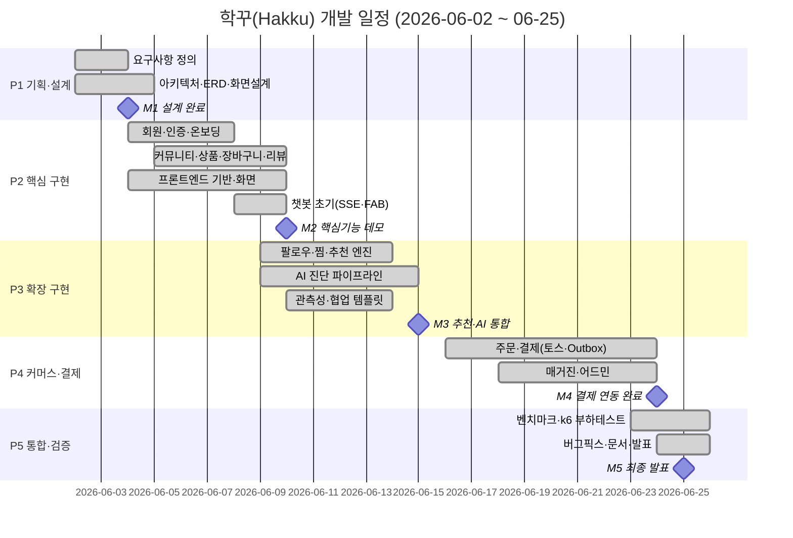

# Gantt Chart (프로젝트 일정표)

> 프로젝트: 학꾸(Hakku) · 작성일: 2026-06-25 · 버전 1.0

---

## 1. 개요

학꾸(Hakku)는 AI 퍼스널컬러 기반 꾸미기 아이템 추천 커머스·커뮤니티 플랫폼으로, SSAFY 자율 프로젝트 기간 **2026-06-02 ~ 2026-06-25(약 4주)** 동안 폴리글랏 마이크로서비스 아키텍처(Nginx 리버스 프록시 뒤 6개 서비스)로 개발되었다. 본 문서는 실제 git 커밋 이력에 근거한 프로젝트 일정(간트 차트·WBS·마일스톤)을 정의하며, 요구사항 정의서·시스템 설계서 등 타 산출물과 상호참조된다.

전체 일정은 다음 5개 단계(P1~P5)로 구성된다.

| 단계 | 명칭 | 기간 | 한 줄 요약 |
|---|---|---|---|
| **P1** | 기획·설계 | 06/02 ~ 06/04 | 요구사항 확정, 아키텍처·ERD·화면설계, 기술스택 선정 |
| **P2** | 핵심 구현 | 06/04 ~ 06/10 | 회원·인증·커뮤니티·상품·장바구니·리뷰, 프론트 기반, 챗봇 초기, Storage |
| **P3** | 확장 구현 | 06/09 ~ 06/15 | 팔로우·찜·추천 엔진·AI 진단 파이프라인·관측성, 협업 템플릿 |
| **P4** | 커머스·결제 고도화 | 06/16 ~ 06/24 | 주문·토스페이먼츠 결제·Outbox·웹훅·매거진·어드민 |
| **P5** | 통합·검증·마무리 | 06/23 ~ 06/25 | Go vs Spring 벤치마크·k6 부하테스트·버그픽스·문서·발표 준비 |

단계 간 일부 기간이 중첩되는 것은 마이크로서비스별 병렬 작업과 2인 팀(천창현·김해찬)의 역할 분담에 따른 자연스러운 동시 진행을 반영한 것이다. 진척 마일스톤은 M1(설계완료, 6/4)·M2(핵심기능 데모, 6/10)·M3(추천·AI 통합, 6/15)·M4(결제 연동, 6/24)·M5(최종 발표, 6/25)로 설정하였다.

---

## 2. 간트 차트

아래 그림은 학꾸 개발 전체 일정을 단계별 작업과 마일스톤으로 시각화한 간트 차트이다.

**그림 5-1. 학꾸 개발 일정 간트 차트**

---

## 3. 단계별 일정 상세표

각 단계의 세부 작업, 기간, 주담당, 핵심 산출물을 정리한다. WBS 식별자(W{n}/W{n}.{m})는 작업 추적성을 위해 부여하였다.

### P1 — 기획·설계 (06/02 ~ 06/04)

| WBS | 작업 | 시작일 | 종료일 | 기간 | 주담당 | 핵심 산출물 |
|---|---|---|---|---|---|---|
| W1.1 | 요구사항 정의 | 06/02 | 06/03 | 2일 | 공통 | 기능/비기능 요구사항(FR/NFR) 정의서, 유스케이스(UC) 목록 |
| W1.2 | 아키텍처·ERD·화면설계 | 06/02 | 06/04 | 3일 | 공통 | 마이크로서비스 아키텍처도, ERD(테이블 18+2), 화면설계(SCR-01~22), 기술스택 선정서 |

**단계 요약**: 6개 서비스(frontend, main-server, payment-server, ai-server, chatbot-server, storage-server) 분리 기준과 공유 hakku DB 전략, 16종 퍼스널컬러 진단 흐름, 결제·알림 파이프라인의 골격을 확정하였다. 이 단계의 산출물은 **M1 설계완료** 마일스톤의 판정 근거가 된다.

### P2 — 핵심 구현 (06/04 ~ 06/10)

| WBS | 작업 | 시작일 | 종료일 | 기간 | 주담당 | 핵심 산출물 |
|---|---|---|---|---|---|---|
| W2.1 | 회원·인증·온보딩 | 06/04 | 06/07 | 4일 | 천창현 | JWT 인증, 회원가입/로그인/리프레시, 온보딩(선호 컬러·스타일) — `/api/auth`, `/api/users` |
| W2.2 | 커뮤니티·상품·장바구니·리뷰 | 06/05 | 06/09 | 5일 | 천창현 | posts/comments/post_likes, products/product_styles/product_colors, cart_items, reviews — 도메인 CRUD |
| W2.3 | 프론트엔드 기반·화면 | 06/04 | 06/09 | 6일 | 천창현 | Vue 3 + Vite + Tailwind + Pinia 기반 구축, 라우트 가드, 주요 화면(SCR-01~SCR-12 다수) |
| W2.4 | 챗봇 초기(SSE·FAB) | 06/08 | 06/09 | 2일 | 김해찬 | chatbot-server SSE 스트리밍 골격, 전역 ChatFab UI |

**단계 요약**: 회원·인증을 기반으로 커뮤니티·상품·장바구니·리뷰 등 핵심 도메인과 프론트엔드 기반을 구축하고, 챗봇 SSE 스트리밍 및 FAB의 초기 형태를 마련하였다. 이 단계의 산출물은 **M2 핵심기능 데모** 마일스톤의 판정 근거가 된다.

### P3 — 확장 구현 (06/09 ~ 06/15)

| WBS | 작업 | 시작일 | 종료일 | 기간 | 주담당 | 핵심 산출물 |
|---|---|---|---|---|---|---|
| W3.1 | 팔로우·찜·추천 엔진 | 06/09 | 06/13 | 5일 | 천창현 | follows, wishlists/wishlist_likes, RecommendationScoreCalculator(설명가능 점수 분해) — `/api/recommendations` |
| W3.2 | AI 진단 파이프라인 | 06/09 | 06/14 | 6일 | 천창현 | ai-server 진단 흐름(202 즉시반환→백그라운드 gpt-image-2/gpt-5.4-mini→16종 ENUM 파싱→Kafka DIAGNOSIS_COMPLETE), 상태머신 NONE→PENDING→COMPLETED |
| W3.3 | 관측성·협업 템플릿 | 06/10 | 06/13 | 4일 | 천창현·김해찬 | Prometheus/Grafana/Jaeger 관측성, GitHub 이슈/PR 협업 템플릿 |

**단계 요약**: 추천 엔진과 AI 퍼스널컬러 진단 파이프라인이라는 학꾸의 차별화 기능을 완성하고, 관측성 스택과 협업 환경을 정비하였다. 이 단계의 산출물은 **M3 추천·AI 통합** 마일스톤의 판정 근거가 된다.

### P4 — 커머스·결제 고도화 (06/16 ~ 06/24)

| WBS | 작업 | 시작일 | 종료일 | 기간 | 주담당 | 핵심 산출물 |
|---|---|---|---|---|---|---|
| W4.1 | 주문·결제(토스·Outbox) | 06/16 | 06/23 | 8일 | 김해찬 | orders/order_items, payment-server(payments/payment_outbox), 토스페이먼츠 confirm·웹훅(HMAC-SHA256), 낙관적 락(@Version), OutboxRelay→Kafka(payment.approved/failed), OrderPaymentConsumer 주문 PAID 전이 |
| W4.2 | 매거진·어드민 | 06/18 | 06/23 | 6일 | 천창현 | magazines(마크다운), 매거진 상세(SCR-20)·어드민 매거진 CRUD(SCR-21)·상품 전체 관리(SCR-22) |

**단계 요약**: Intent→Charge→Settle 결제 모델과 트랜잭셔널 아웃박스 기반 at-least-once 이벤트 전파를 구현하고, 마크다운 매거진과 어드민 관리 기능을 완성하였다. 이 단계의 산출물은 **M4 결제 연동** 마일스톤의 판정 근거가 된다.

### P5 — 통합·검증·마무리 (06/23 ~ 06/25)

| WBS | 작업 | 시작일 | 종료일 | 기간 | 주담당 | 핵심 산출물 |
|---|---|---|---|---|---|---|
| W5.1 | 벤치마크·k6 부하테스트 | 06/23 | 06/25 | 3일 | 천창현 | Go(storage-server) vs Spring(storage-server-spring) 대조군 벤치마크, k6 부하테스트 리포트 |
| W5.2 | 버그픽스·문서·발표 | 06/24 | 06/25 | 2일 | 공통 | 통합 버그픽스, 설계/운영 문서, 최종 발표 자료 |

**단계 요약**: 이미지 저장 서비스의 Go·Spring 대조 벤치마크와 k6 부하테스트로 성능을 검증하고, 통합 버그픽스·문서화·발표 준비로 프로젝트를 마무리하였다. 이 단계의 종료는 **M5 최종 발표** 마일스톤으로 확정된다.

---

## 4. 마일스톤 표

각 마일스톤의 일자, 연관 단계, 그리고 달성 여부를 판단하는 판정 기준을 정의한다.

| ID | 마일스톤 | 일자 | 연관 단계 | 판정 기준 |
|---|---|---|---|---|
| **M1** | 설계완료 | 06/04 | P1 | 요구사항(FR/NFR)·유스케이스(UC) 확정, 마이크로서비스 아키텍처·ERD(테이블 18+2)·화면설계(SCR-01~22)·기술스택 선정서가 모두 승인됨 |
| **M2** | 핵심기능 데모 | 06/10 | P2 | 회원가입·로그인(JWT)·온보딩, 상품·커뮤니티·장바구니·리뷰 CRUD가 프론트엔드에서 정상 동작하고, 챗봇 SSE·FAB 초기 형태가 시연 가능 |
| **M3** | 추천·AI 통합 | 06/15 | P3 | AI 퍼스널컬러 진단(202 비동기→16종 ENUM→COMPLETED)과 설명가능 추천 점수(`/api/recommendations`)가 종단 간 동작, 팔로우·찜 완료, 관측성 스택 가동 |
| **M4** | 결제 연동 | 06/24 | P4 | 토스페이먼츠 결제(intent/confirm·웹훅 HMAC 검증)와 Outbox→Kafka→주문 PAID 전이가 멱등·낙관적 락 기준으로 정상 완료, 매거진·어드민 기능 완성 |
| **M5** | 최종 발표 | 06/25 | P5 | Go vs Spring 벤치마크·k6 부하테스트 결과 확보, 잔여 버그 해소, 설계 문서·발표 자료 완비 및 최종 발표 수행 |

---

## 5. 주차별 요약 및 실제 진행 코멘트

실제 git 커밋 분포(천창현 약 203 커밋, 김해찬 약 11 커밋)를 기준으로 주차별 진행 양상과 회고 코멘트를 정리한다. 주차 표기는 ISO 주차(W23~W26)를 따른다.

| 주차 | 기간 | 연관 단계 | 진행 양상 | 회고 코멘트 |
|---|---|---|---|---|
| **W23** | 06/02 ~ 06/08 | P1, P2 | 집중 구축 | 설계 확정 직후 회원·인증·커뮤니티·상품 등 핵심 도메인과 프론트 기반이 한꺼번에 올라온 가장 밀도 높은 주차. 천창현 주도로 메인 서버·프론트가 빠르게 골격을 갖추었고, 김해찬은 챗봇 SSE·FAB 초기 구현에 착수했다. |
| **W24** | 06/09 ~ 06/15 | P3 | 안정화 | 팔로우·찜·추천 엔진과 AI 진단 파이프라인 등 차별화 기능을 확장하면서 기존 핵심 도메인을 안정화한 주차. 관측성(Prometheus/Grafana/Jaeger)과 협업 템플릿이 정비되어 이후 결제·커머스 고도화의 발판이 마련되었다. |
| **(주중)** | 06/16 ~ 06/22 | P4(준비) | 소강 | 외형 커밋 빈도가 낮아진 소강 구간. 결제·Outbox 설계 정밀화, 데이터셋·시드 데이터 준비, 추천·진단 내부 튜닝 등 가시화되지 않는 설계·데이터 작업에 시간이 투입되었다. 막판 고도화를 위한 사전 정지 작업 성격이 강하다. |
| **W26** | 06/23 ~ 06/25 | P4(마무리), P5 | 막판 고도화 | 결제(토스·Outbox·웹훅)·어드민·추천·벤치마크가 단기간에 집중적으로 마무리된 주차. 김해찬은 payment-server·결제 프론트를 완성하고, 천창현은 매거진/어드민·Go vs Spring 벤치마크·k6 부하테스트를 마감하며 M4·M5를 연달아 달성했다. |

### 회고 종합

학꾸 프로젝트는 4주라는 짧은 기간에 6개 폴리글랏 서비스를 통합한 도전적 일정이었다. 초반 2주(W23~W24)에 핵심·확장 기능을 집중적으로 끌어올린 뒤, 중간 소강 구간에서 결제·데이터 작업을 다지고, 마지막 주(W26)에 커머스·결제·검증을 압축적으로 완성하는 "프런트로딩 후 막판 스퍼트" 패턴을 보였다. 2인 팀의 명확한 역할 분담(천창현=Lead/BE·AI·Infra·FE, 김해찬=결제·챗봇·협업환경)이 병렬 진행을 가능하게 했으며, 모든 단계 작업이 완료(done) 상태로 마감되어 M1~M5 마일스톤을 전부 달성하였다.
